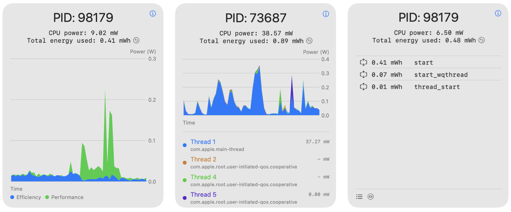
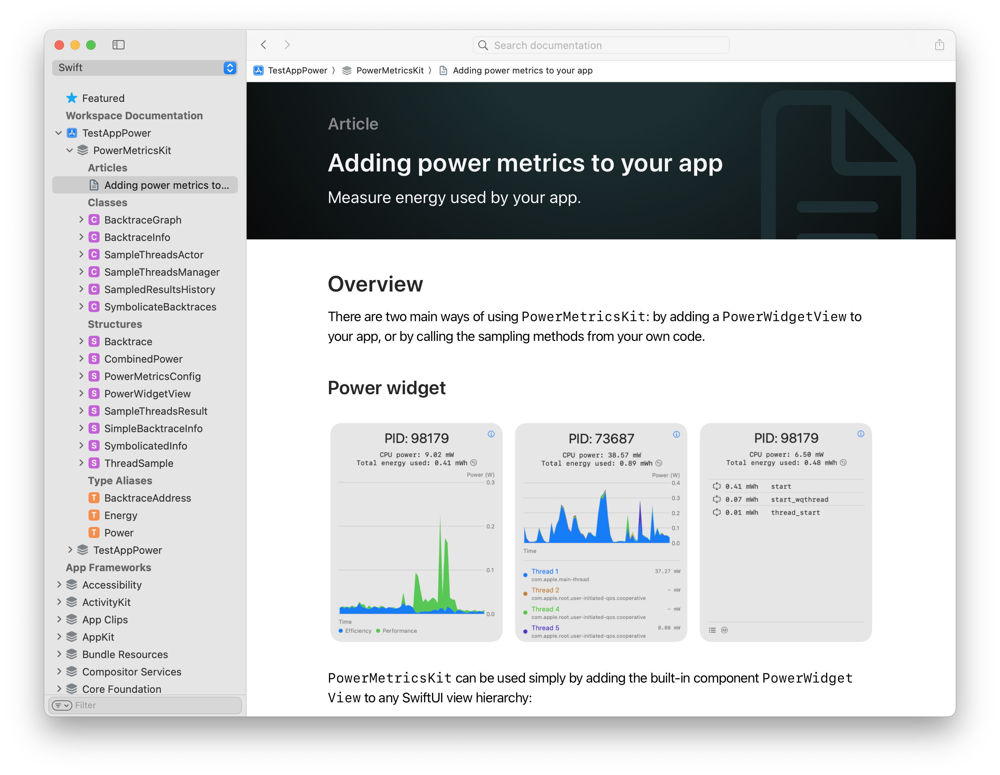

#  PowerMetricsKit



A package to retrieve realtime information on CPU energy consumption using the CPU's Closed Loop Performance Controller (CLPC) via `proc_pidinfo`.

## How does it work?

Code related to energy measurements is under PowerWidget/. It works by using `libproc`'s `proc_pidinfo` with the new `PROC_PIDTHREADCOUNTS` option, which returns a `struct` including per-thread energy measurements from the CPU's' CLPC, which in turn obtains the energy results from the Digital Power Estimator (DPE). The list of all threads is retrieved using `task_threads` with the PID of the current task (root privileges are required to invoke `task_threads` on other processes).

The `libproc.h` headers can't be imported on iOS, so they're reproduced at the beginning of `sample_threads.c`, as well as the result `struct`s from the `proc_pidinfo`, using the definitions and documentation available in [Apple's OSS Distributions repository for `libproc.h`](https://github.com/apple-oss-distributions/xnu/blob/aca3beaa3dfbd42498b42c5e5ce20a938e6554e5/bsd/sys/proc_info.h).

## Documentation

This package is documented using DocC. Please see PowerMetricsKit's [documentation site](https://androp0v.github.io/PowerMetricsKit/documentation/powermetricskit/) or use _Xcode > Product > Build documentation_ to compile the documentation for the package and view it locally.



## Results
When running a single app in the foreground, the results correlate well with wall power (measured with a USB-C amp/volt meter with the device charged to 100%), after substracting the energy used by the device while idling. On macOS, results are almost identical to the `powermetrics` output (this app reports slightly less power used, which makes sense since `powermetrics` also includes CPU power used by other apps and the OS).

The results are promising when experimenting with pathologic cases, and qualitatively match the predicted behavior. For example, making all threads wait forever on a spinlock makes the CPU utilization skyrocket (~100%/core) but power consumption remains very modest (less than 5W on a M3 Max w/16 cores), compared to ALU-heavy code like the simulation included with this app, that has lower CPU utilization (~30%) but uses much more power (~20W on M3 Max w/16 cores).
 
## Limitations

Since without root privileges and/or specific entitlements only the energy of the threads from the same process can be measured, APIs that trigger work on a kernel thread (ie system calls) won't be accounted for in the power metrics of the app.

## Compatibility

Tested on A14 Bionic or newer CPUs.

## Generate documentation

Run this code on a Terminal window at the root of the PowerMetricsKit package to generate the documentation for this project used in GitHub pages.
```zsh
swift package --allow-writing-to-directory docs generate-documentation --target PowerMetricsKit --disable-indexing --transform-for-static-hosting --hosting-base-path PowerMetricsKit --output-path docs
```

## References

[1] [Apple's OSS Distributions source for `libproc.h`](https://github.com/apple-oss-distributions/xnu/blob/aca3beaa3dfbd42498b42c5e5ce20a938e6554e5/bsd/sys/proc_info.h).
[2] [Apple's OSS Distributions overview of `Recount` subsystem](https://github.com/apple-oss-distributions/xnu/blob/5c2921b07a2480ab43ec66f5b9e41cb872bc554f/doc/recount.md).
